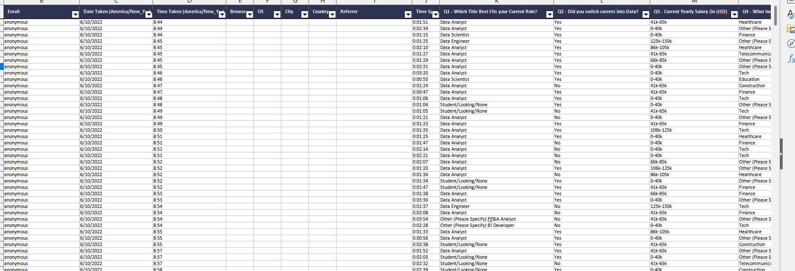
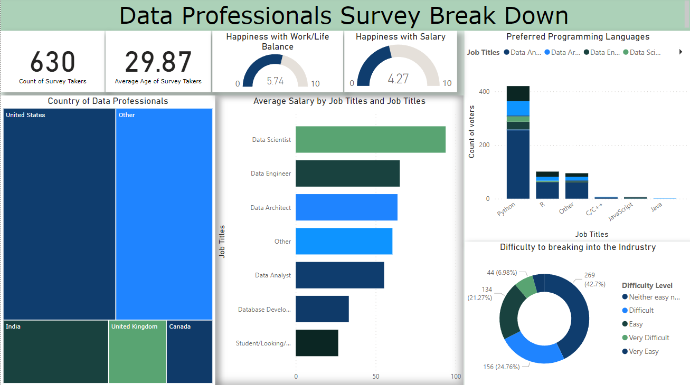

# Data Professionals Survey Break Down dashboard

This dasboard go through one sample of one survey with data professionals.
This survey was take as a Excel file.

And one we build this dashboard:

## Interesting points on development
 1.Calculation of an average of salary from one string column containing salary range, using the split column option. 

 | From this                | To this             |
 ---------------------------|---------------------|
 |  | |
 
 2.Transforming the Date Taken column using Locale avoiding errors due to different Regional Settings.
 
 3.Shorting the data domain by eliminating open-ended answers using the split option.
  | From this               | To this             |
 ---------------------------|---------------------|
 |  | |